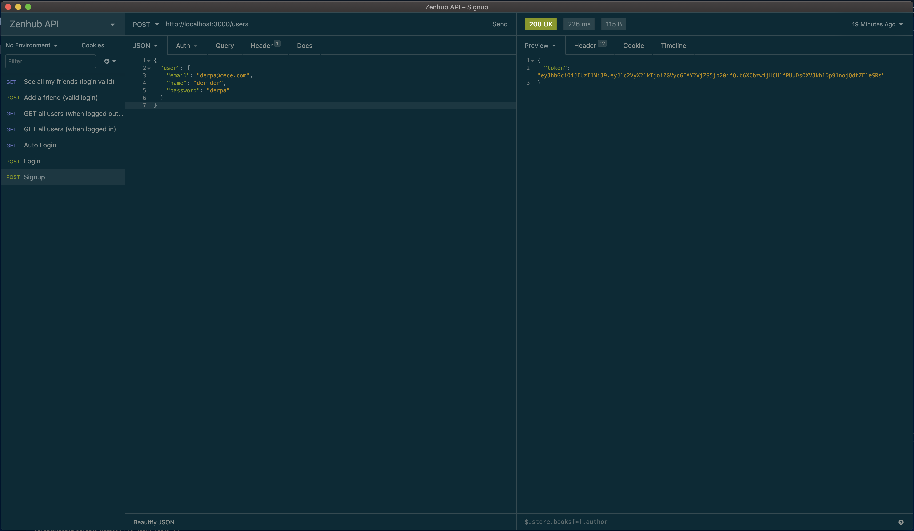
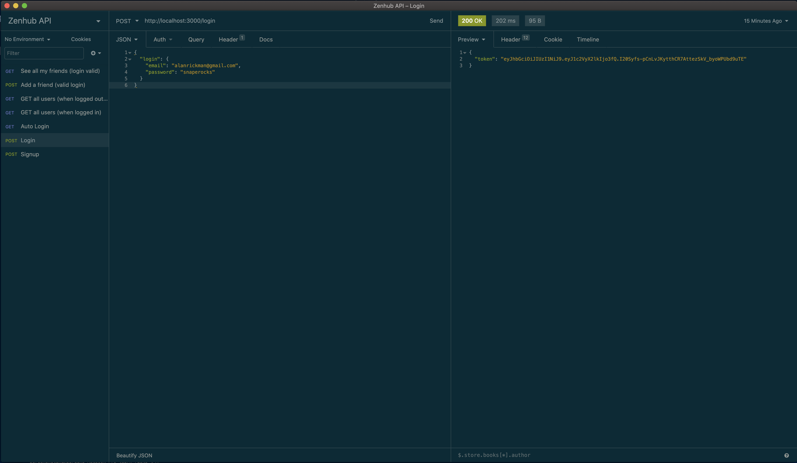
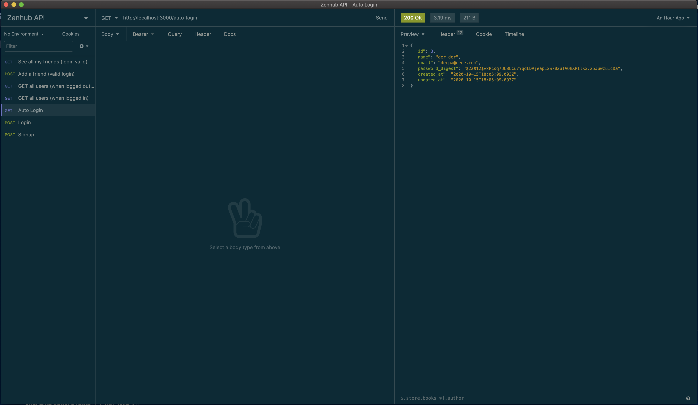
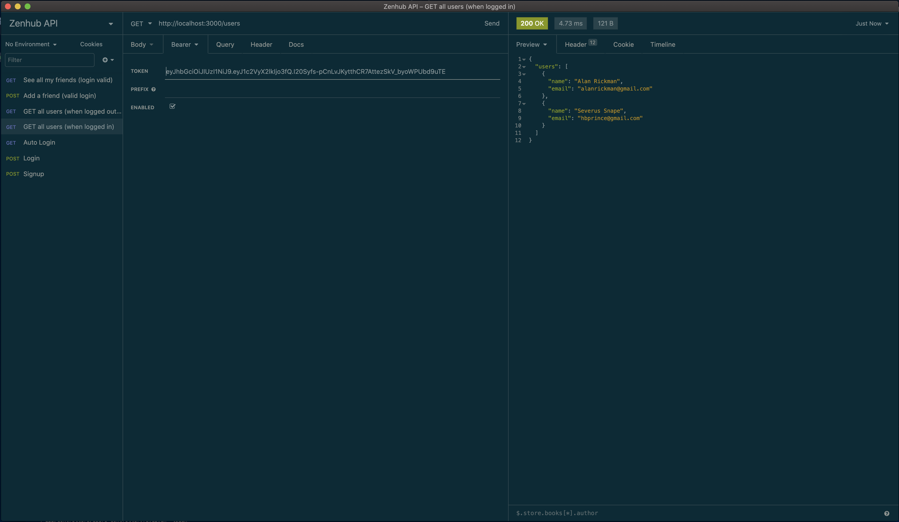
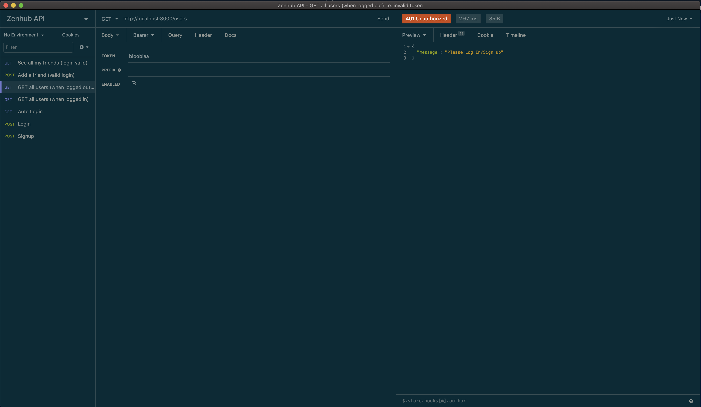

## How to run

- `bundle install`
- `rails db:reset db:migrate db:seed`
- `rails s -p YOURPORTCHOICE`

## How to test

- For now, the test suite consists of using Insomnia to test against the API
- Due to Insomnia's sharing features requiring Premium, the only way to test the app would be to use a personal Insomnia account
- However, attached below are screenshots of tests run against the app using Insomnia
- There are NO specs written for the controllers, but that can be added in as well

### Valid Sign Up

### Valid Log In

### Valid Auto LogIn

### Valid All Users

### Valid Log In

